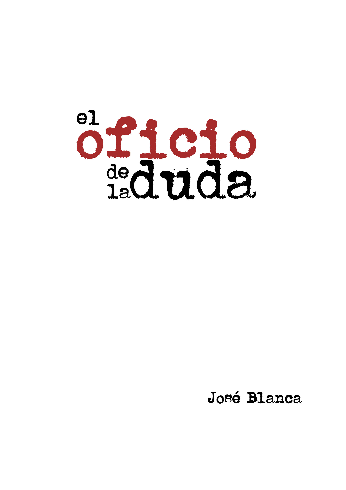

*El oficio de la duda* es una introducción a la filosofía de la ciencia escrita por José Blanca.

En una sociedad que depende de la ciencia y la tecnología para cuestiones tan críticas como la salud o la alimentación es muy importante que los ciudadanos se planteen algunas cuestiones fundamentales: ¿Qué caracteriza al conocimiento científico, qué lo hace especial, cuáles son sus fortalezas y sus limitaciones? ¿En qué circunstancias es razonable confiar en lo que dicen los expertos y cuándo es preferible reservar el juicio? En *el oficio de la duda* se abordarán estos asuntos siguiendo el desarrollo de las ideas filosóficas que, partiendo de la Grecia clásica, condujeron al desarrollo de la ciencia moderna, evaluando las críticas radicales planteadas por Kuhn y compañía en los años 70 y resumiendo los principales avances del siglo XXI.

Puedes leer el libro en la [web](leer/prefacio.html) o descargarlo.

<figure>
  
  <figcaption>Desgargar: <a href='files/el_oficio_de_la_duda.epub'>epub</a>, <a href='files/el_oficio_de_la_duda.mobi'>mobi</a> o <a href='files/el_oficio_de_la_duda.pdf'>pdf</a>.</figcaption>
</figure>
