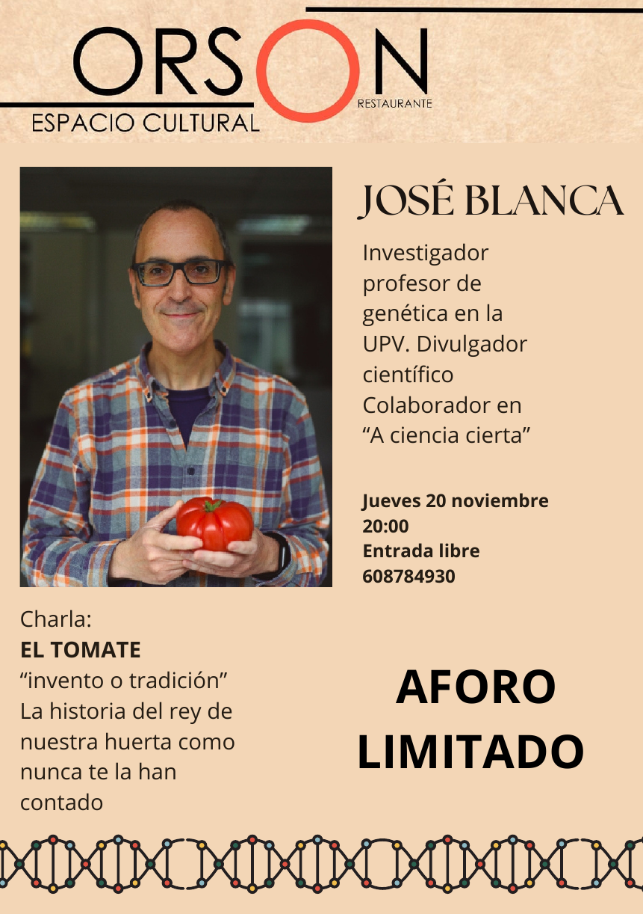

# Charla, historia del tomate: invento o tradición

Mañana jueves 19 de noviembre en el restaurante [Orson](https://www.restauranteorson.com/) hablaré sobre la historia del tomate, la real y la imaginada.
Por si alguien tiene curiosidad, las diapositivas están disponibles: [Historia del tomate: invento o tradición](https://docs.google.com/presentation/d/1qDq2hbTpsQCnKpPbCRkKw6_6yxjN2epjRAO_p4MZzKg/edit?usp=sharing).

<iframe src="https://www.google.com/maps/embed?pb=!1m18!1m12!1m3!1d1995.7871950243741!2d-0.38896328387338136!3d39.46924819656591!2m3!1f0!2f0!3f0!3m2!1i1024!2i768!4f13.1!3m3!1m2!1s0xd604f46c0aa6ef5%3A0xa32a5aad7dfe46fb!2sRestaurante%20Orson!5e1!3m2!1ses!2ses!4v1763559303390!5m2!1ses!2ses" width="600" height="450" style="border:0;" allowfullscreen="" loading="lazy" referrerpolicy="no-referrer-when-downgrade"></iframe>