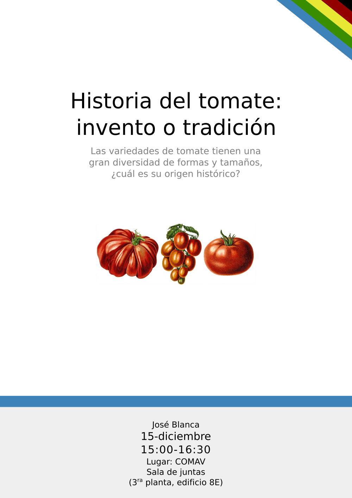

# Seminario sobre la historia del tomate

Hoy hablaré sobre la historia del tomate fuera de su región de origen, desde el siglo XVI hasta la actualidad. El seminario se hará en la sala de juntas del COMAV a las 15:00.
Si alguien tiene curiosidad puede echar un ojo a las [diapositivas](https://docs.google.com/presentation/d/1ywW6KRwsEf6JsHuoqHZUkfojzJkGjKZtNtM1huaT3nU/edit?usp=drive_link).

