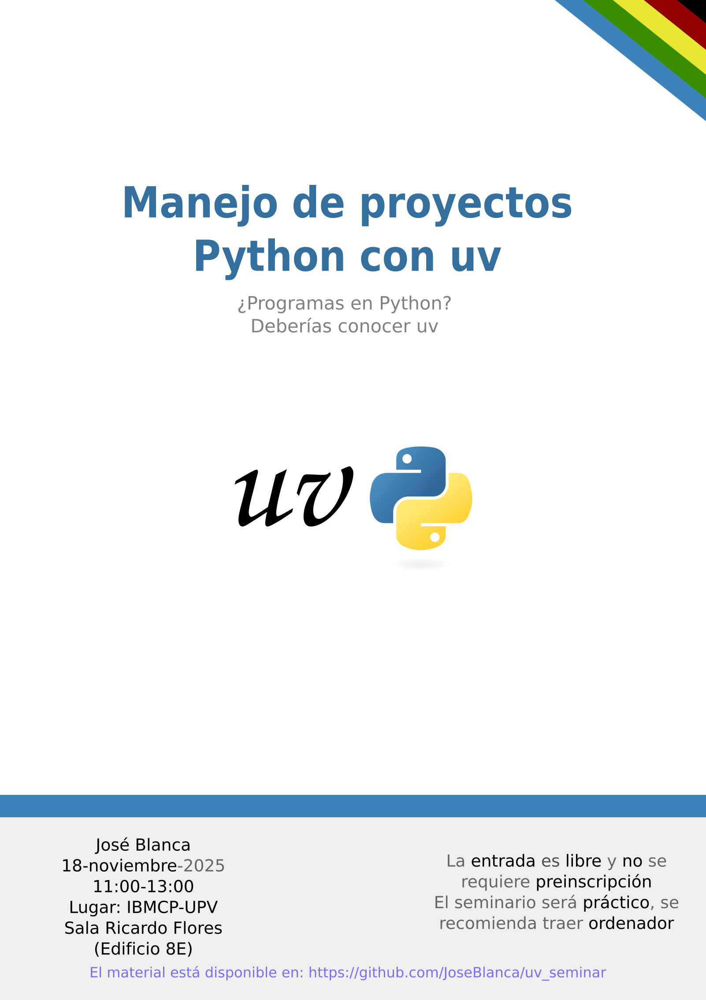

# uv seminar

Today we will talk about [`uv`](https://docs.astral.sh/uv), [virtual environments](https://docs.python.org/3/glossary.html#term-virtual-environment), package dependencies, reproducibility and Python project management.

All the [seminar materials](https://github.com/JoseBlanca/uv_seminar) can be found in its GitHub repository.

The seminar will be held in [IBMCP](https://ibmcp.upv.es/) at [UPV](https://upv.es/) at the Ricardo Flores room and is open for anybody interested in Python that is not yet familiar with `uv`.